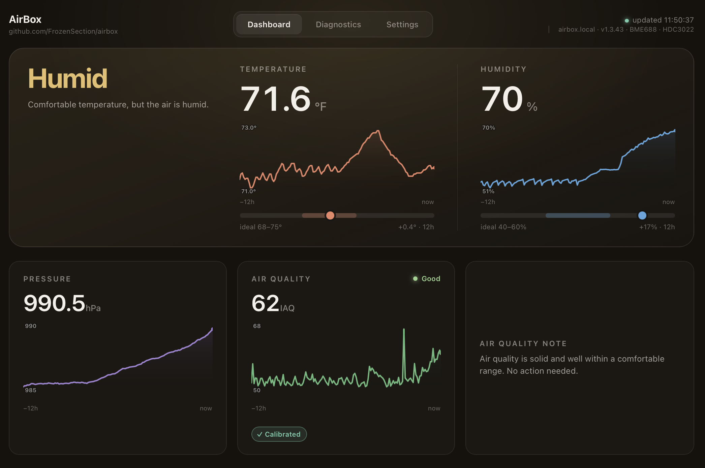

# AirBox

A small, self-contained indoor **environmental monitor** built on an Adafruit
QT Py ESP32-S3. It measures temperature, humidity, barometric pressure, and air
quality, and serves everything from a **local web dashboard** on your own WiFi —
no cloud, no app, no Home Assistant required.


<!-- Drop a screenshot at docs/img/dashboard.png -->

## What it does

- **Measures:** temperature & humidity (HDC3022, lab-grade), barometric
  pressure and air quality / IAQ (BME688 via Bosch BSEC2).
- **Local dashboard:** live readings + 24 h trend charts at
  `http://airbox.local`, served straight from the device. Works on a network
  with no internet access.
- **Easy WiFi setup:** on first boot it creates a setup hotspot; scan the QR
  code on the OLED with your phone, pick your network, done.
- **Browser firmware updates:** upload new firmware from the dashboard — no
  cable, no IDE.
- **Robust by design:** hardware watchdog, automatic sensor recovery, and
  air-quality calibration that survives reboots and WiFi changes.

## Hardware

- Adafruit QT Py ESP32-S3
- Adafruit HDC3022 precision temperature/humidity sensor (STEMMA QT)
- Adafruit BME688 4-in-1 sensor (STEMMA QT)
- *Optional:* a 128×64 SSD1306 STEMMA QT OLED (enables on-device readout and
  the setup QR code; the device runs fine headless without it)

All three boards daisy-chain off the QT Py's STEMMA QT port (the secondary I²C
bus, `Wire1`). See [`hardware/`](hardware/) for the enclosure.

## Getting started

> **Just received a device?** The one-page
> [`docs/quick-start.md`](docs/quick-start.md) gets you from power-on to the
> dashboard in four steps.
>
> Assembling and flashing a new unit? The step-by-step
> [`docs/bringup-checklist.md`](docs/bringup-checklist.md) walks the whole
> process — assemble → flash → provision → verify → burn-in.

1. **Build the firmware** — see [`firmware/README.md`](firmware/README.md) for
   the board settings and library list, then flash over USB-C.
2. **First-time WiFi setup** — [`docs/first-time-setup.md`](docs/first-time-setup.md).
3. **Using the dashboard** — what each reading means and what to trust:
   [`docs/dashboard.md`](docs/dashboard.md).
4. **Changing networks / recovery** — [`docs/recovery.md`](docs/recovery.md).

## Repository layout

```
firmware/   Arduino sketch (airbox.ino, config.h, web_ui.h)
hardware/   3D-printable enclosure files + print notes
docs/        setup, dashboard, and recovery guides
```

## Licenses

- **Firmware & software:** MIT — see [`LICENSE`](LICENSE).
- **3D enclosure files:** Creative Commons Attribution 4.0 (CC BY 4.0) — see
  [`hardware/LICENSE`](hardware/LICENSE).

Contributions and remixes welcome.

## Acknowledgments

For honesty about how this was built: the firmware, captive-portal provisioning,
web dashboard, and documentation were **written by Anthropic's Claude** (via
Claude Code), working from the requirements, design decisions, hardware testing,
and review provided by the repo owner. The code is AI-written under human
direction — not hand-coded by the owner.

(Forked from an earlier Home Assistant MQTT sensor and rebuilt as a standalone
device.)
